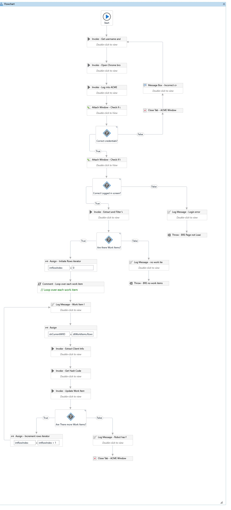
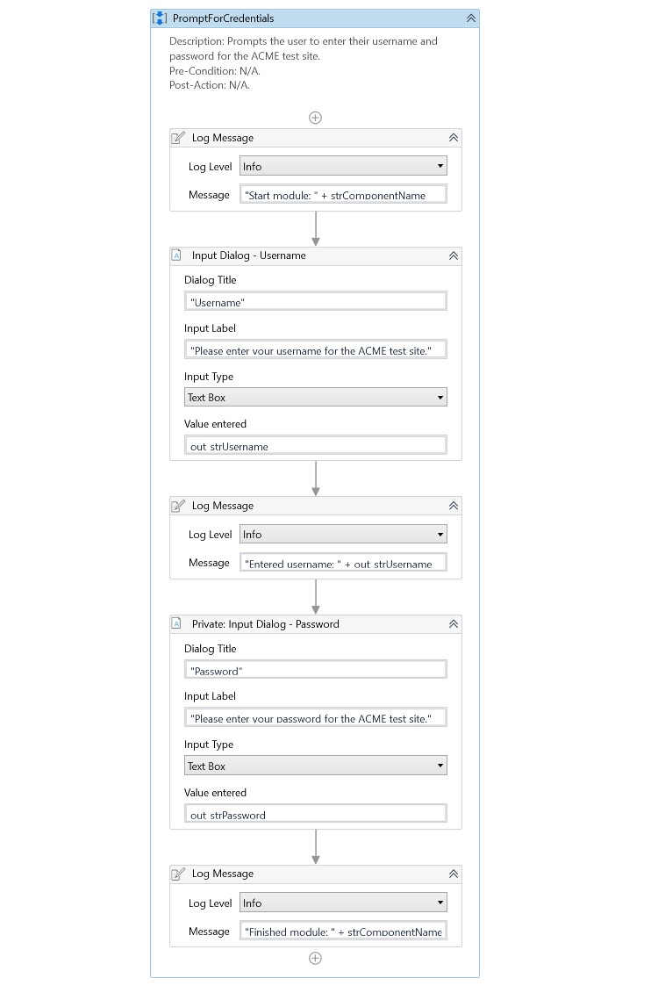
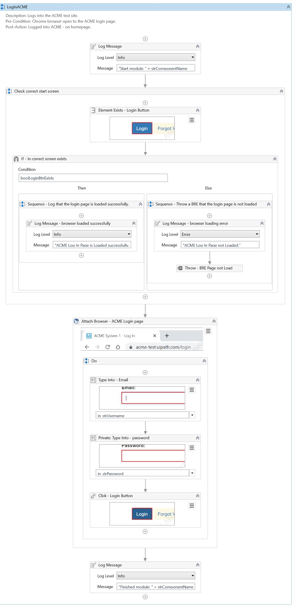
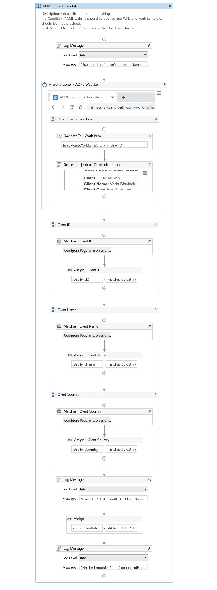
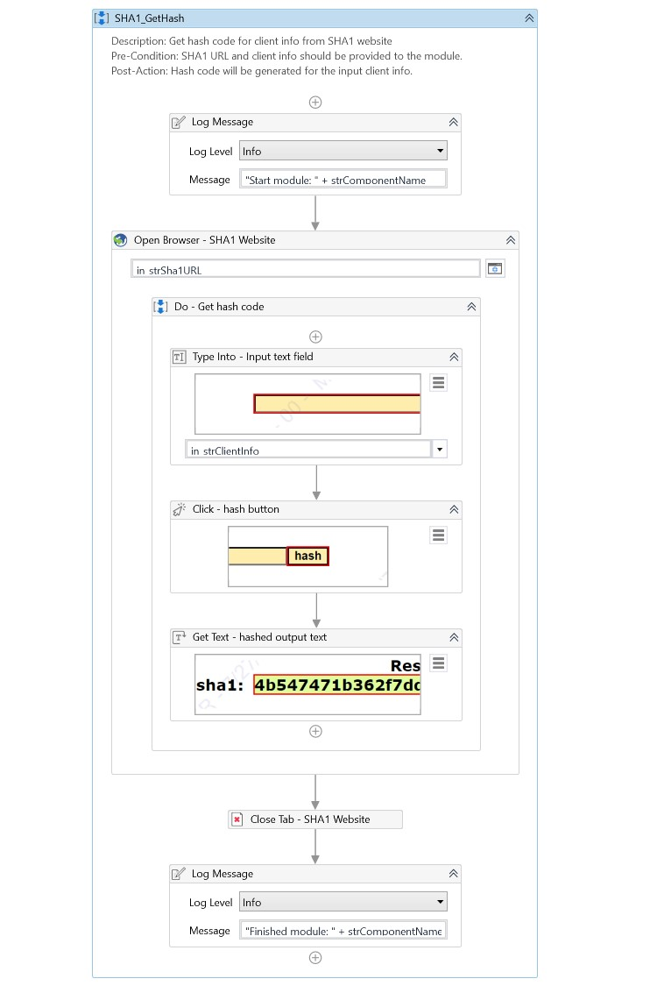
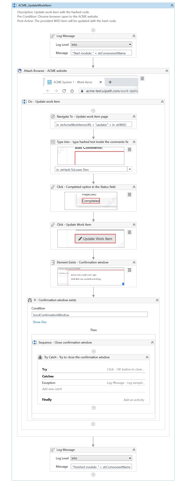

# Calculate Client Security Hash  || RPA Robot with UiPath

## Process Short Description
Generate the Security Hash for each Client based on their personal information.

## Workflows Screenshots

### Main Workflow

### Generic_PromptForCredentials Workflow

### ACME_Login Workflow

### ACME_ExtractWorkItems Workflow

### ACME_ExtractClientInfo Workflow

### SHA1_GetHash Workflow

### ACME_UpdateWorkItem Workflow

## About The Author

* Author: Mohamed Abdel-Gawad Ibrahim
* Contact: muhammadabdelgawwad@gmail.com
* Phone: +201069052620 || +201147821232